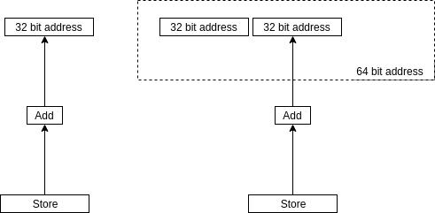

# Global 64 bit pointer support for RISCV 32I LLVM backend

This aims to provide support to access off-chip memory addressable beyond 32 bits. 

### Add extra instruction into the ISA

    LWD a3 a1 a2
    SWD a3 a1 a2

Where ai is a 32 bit register.
At the hardware level, a1 and a2 are concatenated to form a 64 bit address.

### Handling pointer operations on 64 bit pointer

We will use lower 32 bit for operations so to keep things simple the upper 32 bit are just kept glued and operations are normally done as already implemented.

Some remaining task for this:
[ ] Effect of keeping high and low address bit in two nodes and merging them in one.
[ ] Try glue or wrapper for 64 bit support.

### Simulating a single address space

One of the key feature of global pointer is the simulated single address space.
Example:

|<- Address space 0 ->|<- Address space 1 ->|
0 .. .. .. .. .. ..   X .. .. .. .. .. ..   Y

Considering two types of pointer
- 32 bit local pointers 
- 64 bit global pointers

Say LP[i] access i address using local pointer and GP[i] using global pointer.
Then for i < X, 
LP[i] == GP[i]
in the above case global pointer must access address from address space 0.
i > X 
then GP[i] should access GP[i - X] in address space 1.

Presently on the basis of address space we classify the use of new global pointer at backend.

Some remaining task for this phase can be:
[ ] Transformation function between local and global pointers
[ ] Use transformation function to simulate a global address space.
